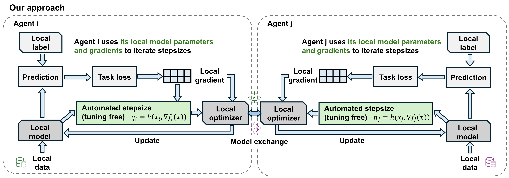
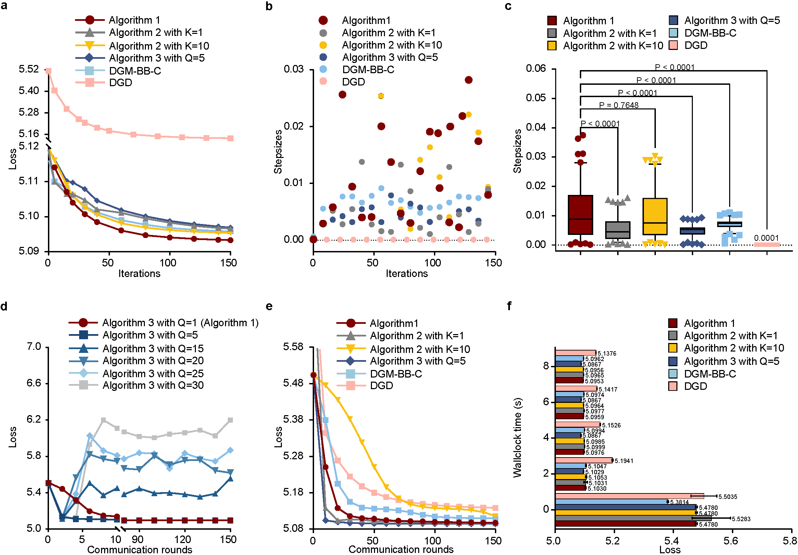

# Automating Stepsizes for Decentralized Optimization and Learning with Geometric Convergence
Decentralized optimization is a promising paradigm for addressing fundamental challenges in machine learning. However, despite the unprecedented success of existing decentralized optimization and learning methods, the selection of effective stepsizes is still elusive.

We propose an approach that allows individual agents to autonomously adapt their individual stepsizes. The effectiveness of the proposed approach is confirmed using three typical machine learning applications on benchmark datasets, including logistic regression, matrix factorization, and image classification.



## Outlines
- Installation Tutorial and Preliminaries
- Logistic Regression
- Matrix Factorization
- Training of Convolutional Neural Networks
- Discussions
- License

## Installation Tutorial and Preliminaries
### Install Setup
1. Clone this [repository](https://github.com/cziqin/Automated_Stepsizes/tree/main)
2. Download and install [Anaconda](https://www.anaconda.com) (if you don't have it already)
3. Create a new virtual environment with python 3.12, take conda as an example:
   ```shell
   conda create -n autostep python=3.12
   conda activate autostep
   ```
4. Install any additional packages you need in this environment using conda or pip. Recommend installing necessary packages by using the following command:
   ```shell
   pip install -r requirements.txt
   ```

### Hardware/computing resources
The experiments were conducted using the Windows 11 OS equipped with a 32-core CPU, 32GB RAM, and one NVIDIA GeForce RTX 4090 GPU with 24GB VRAM.

### Repository Structure
```
├── Logistic_regression                 # directory to implement logistic regression classification
│   ├── results                         # save experimental results (.csv files)
│   ├── loss_function.py                # the used loss function 
│   ├── main.py                         # entry point
│   ├── matrix.py                       # excuctes Subroutine 1, finite-time consensus, or imperfect consensus
│   ├── mushrooms                       # the "mushrooms" datasets
│   ├── optimizer.py                    # optimization algorithms
│   └── train.py                        # script for model training and evaluation
├── Matirx_factorization
│   ├── main.py                         # entry point
│   ├── matrix.py                       # excuctes Subroutine 1, finite-time consensus, or imperfect consensus
│   ├── optimizer.py                    # optimization algorithms
│   └── u.data                          # the "MovieLens 100k" dataset
├── Neural_networks                         
│   ├── datadeal.py                     # splits the downloaded "ImageNet" dataset into training and test sets          
│   ├── main.py                         # entry point
│   ├── matrix.py                       # excuctes Subroutine 1 or finite-time consensus
│   ├── models.py                       # the model used in the CNN training on the "Cifar-10" dataset
│   ├── ops.py                          # optimization algorithms
│   ├── resnet.py                       # the model used in the CNN training on the "ImageNet" dataset   
│   └── train.py                        # script for model training and evaluation
├── LICENSE                             # License file
├── README.md                                             
└── requirements.txt                    # list of dependencies required to run the project             
```

### Datasets
| Datasets       | Download link                                            | Storage Location                   |
|----------------|----------------------------------------------------------|------------------------------------|
| Mushrooms      | https://www.csie.ntu.edu.tw/~cjlin/libsvmtools/datasets/ | `./Logistic_regression/`           |
| MovieLens 100k | https://grouplens.org/datasets/movielens/                | `./matrix_factorization/`          |
| CIFAR-10       | https://www.cs.toronto.edu/~kriz/cifar.html              | `./Neural_networks/data/`          |
| ImageNet       | https://image-net.org                                    | `./Neural_networks/data/imagenet/` |

Ensure that each dataset is downloaded and placed in its corresponding directory before running the experiments.
>Note: For the "ImageNet" dataset, you should first ensure that the [dataset](https://image-net.org) has been downloaded. Then, you need to run [datadeal](./Neural_networks/datadeal.py) to split the dataset into the training set and the test set, respectively. This step ensures that no data leakage occurs. Finally, make sure the training and test sets are placed in the `./Neural_networks/data/imagenet/train` and `./Neural_networks/data/imagenet/sort_val` directories, respectively. 

## Logistic regression
1. You can use the following command to execute Algorithm 1 for the logistic regression task:
    ```shell
    python main.py --test_num 0 --iterations 1000
    ```
   > Note: Please change directory to [`./Logistic_regression`](./Logistic_regression) before running the above command.

   
   - `--test_num`: specifies the optimization algorithm to be trained: `0`:Algorithm 1; `1`: Algorithm 2; `2`: DGM-BB-C [1]; `3`: DGD [2].
   - `--iterations`: sets the number of training iterations.
2. To execute Algorithm 2 with a desired number of inner-consensus-loop iterations $K$ (e.g., $K=10$), you can run the following command:
   ```shell
   python main.py --test_num 1 --iterations 1000 --k_loop 10
   ```
3. To execute Algorithm 3 with a desired number of asynchronous-parallel-update iterations $Q$ (e.g., $Q=10$), you can run the following command:
   ```shell
   python main.py --test_num 0 --iterations 1000 --const_q 10
   ```
   > Note: The parameter `K` represents the number of inner-consensus-loop iterations in Algorithm 2 and DGM-BB-C. The parameter `Q` represents the number of asynchronous-parallel-update iterations in Algorithm 3.
4. In this experiment, we set the stepsize $\eta=1/L_{\max}=0.0351132$ for DGD, which follows the default paramater suggested by [2]. The stepsizes of Algorithm 1, Algorithm 2, and DGM-BB-C are automatically adjusted without requiring any manual tuning.
5. Our tuning-free stepsize update code in the [`optimizer.py`](./Logistic_regression/optimizers.py) file is given as follows:
   ```python
   if iteration == 0:
       self.eta[i].append(self.eta[i][0])
   else:
       a = np.sqrt(1 + self.eta[i][iteration] / self.eta[i][iteration - 1]) * self.eta[i][iteration]
       b = la.norm(self.agent_parameters[i][iteration + 1] - self.agent_parameters[i][iteration]) / (2 * la.norm(self.agent_y[i][iteration+ 1] - self.agent_y[i][iteration]))
       self.eta[i].append(min(a, b))
   ```
### Experimental results
<div style="text-align:center">
  
</div>

- Fig. a shows the loss evolution of Algorithm 1, Algorithm 2 with $K=1$, Algorithm 2 with $K=10$, Algorithm 3 with $Q=10$, DGM-BB-C with $K=1$, and DGD over iterations, respectively.
  The result demonstrates that Algorithm 1 has better convergence accuracy compared with its single-inner-consensus-loop variant (Algorithm 2 with $K=1$, its asynchronous-parallel-update variant (Algorithm 3 with $Q=10$), the decentralized adaptive algorithm with Barzilai-Borwein stepsizes (DGM-BB-C [1]), and DGD [2].
- Fig. b and Fig. c show the scatter and box plots of the average stepsize of five agents in the comparison algorithms. Box plots show the median, 1st and 3rd quartiles, and 5th to 95th percentiles. P-values were calculated via one-way analysis of variance (ANOVA) with Tukey's multiple comparison test.
- Fig. d shows the loss evolution of Algorithm 3 under different numbers of asynchronous-parallel-update iterations. The result demonstrates that a moderate number of asynchronous-parallel-update iterations in each communication round can indeed reduce communication overhead and speed up convergence, however, too large an amount of local computation per communication round leads to degraded convergence accuracy, especially in the later stages of convergence. 
- Fig. e and Fig. f show the comparison results of Algorithm 1 with Algorithm 2, Algorithm 3, DGM-BB-C, and DGD in terms of the used communication rounds and wallclock time, respectively. These results confirm that Algorithm 3 with $10$-steps of asynchronous parallel updates achieves the lowest communication complexity and wallclock time compared with existing counterpart algorithms.

> Note: All experimental results (e.g., loss, wallclock time, and average stepsizes) will be autonomously saved as `.csv` files in the `./Logistic_regression/results` directory.

## Matrix factorization
1. You can use the following command to execute Algorithm 1 for the matrix factorization task:
   ```shell
   python main.py --test_num 0 --iterations 1000
   ```
   > Note: Please change directory to [`./Matrix_factorization`](./Matrix_factorization) before running the above command.
   
   
   - `--test_num`: specifies the optimization algorithm to be trained: `0`:Algorithm 1; `1`: Algorithm 2; `2`: DGM-BB-C; `3`: DGD.
   - `--iterations`: sets the number of training iterations.
2. To execute Algorithm 2 with a desired number of inner-consensus-loop iterations $K$ (e.g., $K=10$), you can run the following command:
   ```shell
   python main.py --test_num 1 --iterations 1000 --k_loop 10
   ```
3. To execute Algorithm 3 with a desired number of asynchronous-parallel-update iterations $Q$ (e.g., $Q=10$), you can run the following command:
   ```shell
   python main.py --test_num 0 --iterations 1000 --const_q 10
   ```
4. In this experiment, we set the stepsize $\eta=10^{-4}$ for the DGD, since it was the almost optimal stepsize that we could find based on the following convergence results of DGD [2] under different stepsize settings after $200$ iterations:
   <table>
     <tr> <th rowspan="2">Algorithms</th> <th colspan="9">Stepsizes</th>
     </tr>
     <tr> <th>$10^{-8}$</th>   <th>$10^{-7}$</th>   <th>$10^{-6}$</th> <th>$10^{-5}$</th>   <th>$10^{-4}$</th>   <th>$10^{-3}$</th>
       <th>$10^{-2}$</th>   <th>$10^{-1}$</th>   <th>$10^{0}$</th>
     </tr>
     <tr>
       <td>DGD</td> <td>5.673 </td>  <td>5.667</td>  <td>5.614</td>  <td>5.330</td>
       <td><b>5.135</b></td>  <td>nan</td>  <td>nan</td>  <td>nan</td>  <td>nan</td>
     </tr>
     <tr>
       <td>Algorithm 1 </td>  <td colspan="9"><b>5.095</b></td>
     </tr>
   </table>
   
   >Since the standard deviations of DGD's and Algorithm's losses are both less than 0.001, they are omitted in this table.

### Experimental results
<div style="text-align:center">
  
</div>

- Fig. a shows the loss evolution of Algorithm 1, Algorithm 2 with K=1, Algorithm 2 with K=10, Algorithm 3 with Q=10, DGM-BB-C with K=1 [1], and DGD [2] over 150 iterations, respectively. The result indicate that even under under nonconvex and nonsmooth
objective functions, Algorithm 1 still outperforms DGD and DGM-BB-C in terms of optimization accuracy.
- Fig. b and Fig. c show the scatter and box plots of the average stepsize of five agents in the comparison algorithms. Box plots show the median, 1st and 3rd quartiles, and 5th to 95th percentiles. P-values were calculated via one-way analysis of variance (ANOVA) with Tukey's multiple comparison test.
- Fig. d shows the loss evolution of Algorithm 3 under different numbers of asynchronous-parallel-update iterations. 
- Fig. e and Fig. f show the comparison results of Algorithm 1 with Algorithm 2, Algorithm 3, DGM-BB-C, and DGD in terms of the used communication rounds and wallclock time, respectively. 

> Note: All experimental results (e.g., loss, wallclock time, and average stepsizes) will be autonomously saved as `.csv` files in the `./Matrix_factorization/results` directory.

## 💪 Neural network training
> Note: Please change directory to [`./Neural_networks`](./Neural_networks) before running the following commands.
### Cifar 10
1. You can use the following command to execute Algorithm 1 for the conventional neural network training task on the "CIFAR-10" dataset:
   ```shell
   python main.py --test_num 0 --epochs 70 --batch_size 128 --dataset 'cifar10'
   ```
   
   >Note: Before running the script, please ensure that the [`CIFAR-10`](https://www.cs.toronto.edu/~kriz/cifar.html) dataset has been downloaded and placed in the `./Neural_networks/data` directory.

   - `--test_num`: specifies the optimization algorithm to be trained: `0`:Algorithm 3; `1`: DADAM [3]; `2`: DAMSGrad [4]; `3`: DSGD-N [5]; `4`: ATC-DIGing [6]; `5`: DSGD [2].
   - `--epochs`: sets the number of training epochs.
   - `--batch_size`: sets the batch size for training.
   - `--dataset`: specifies the dataset to be used for training. The default option is 'cifar10'.

2. To execute Algorithm 3 with a desired number of asynchronous-parallel-update iterations $Q$ (e.g., $Q=10$), you can run the following command:
   ```shell
   python main.py --test_num 0 --epochs 70 --batch_size 128 --dataset 'cifar10' --const_q 10
   ```
3. To specify the print interval (e.g., printing the training loss, test accuracy, and average stepsize every $10$ iterations), you can run the following command:
   ```shell
   python main.py --test_num 0 --epochs 70 --batch_size 128 --dataset 'cifar10' --interval 10
   ```
4. To specify the random seed used in training (e.g., setting seed=42), you can run the following command:
   ```shell
   python main.py --test_num 0 --epochs 70 --batch_size 128 --dataset 'cifar10' --seed 42
   ```
5. In this experiment, we set the stepsize $\eta=0.005$ for DADAM, $\eta=0.1$ for DAMSGrad, and $\eta=0.5$ for DSGD-N, respectively, since they were the almost optimal stepsizes that we could find based on the following test-accuracy results after 100 epochs:
<table>
    <tr> 
        <th rowspan="2">Stepsizes</th>    
        <th colspan="4">Algorithms</th>
    </tr>
    <tr> 
        <th>DADAM</th>   
        <th>DAMSGrad</th>  
        <th>DSGD-N</th>   
        <th>Algorithm 3 ($Q=1$; with no tuning)</th>
    </tr>
    <tr>
        <td>10</td> <td>0.309 &pm; 0.096</td> <td>0.164 &pm; 0.040</td> <td>0.100 &pm; 0.000</td> <td rowspan="13"><b>0.804 &pm; 0.011</b></td>
    </tr>
    <tr>
        <td>5</td> <td>0.329 &pm; 0.124</td> <td>0.169 &pm; 0.031</td> <td>0.664 &pm; 0.013</td>
    </tr>
    <tr>
        <td>1</td> <td>0.511 &pm; 0.083</td> <td>0.652 &pm; 0.025</td> <td>0.736 &pm; 0.007</td>
    </tr>
    <tr>
        <td>0.5</td> <td>0.634 &pm; 0.027</td> <td>0.668 &pm; 0.008</td> <td><b>0.764 &pm; 0.008</b></td>
    </tr>
    <tr>
        <td>0.1</td> <td>0.646 &pm; 0.026</td> <td><b>0.762 &pm; 0.008</b></td> <td>0.757 &pm; 0.012</td>
    </tr>
    <tr>
        <td>0.05</td> <td>0.671 &pm; 0.009</td> <td>0.741 &pm; 0.009</td> <td>0.697 &pm; 0.013</td>
    </tr>
    <tr>
        <td>0.01</td> <td>0.754 &pm; 0.023</td> <td>0.718 &pm; 0.022</td> <td>0.619 &pm; 0.026</td>
    </tr>
    <tr>
        <td>0.005</td> <td><b>0.767 &pm; 0.009</b></td> <td>0.713 &pm; 0.018</td> <td>0.571 &pm; 0.007</td>
    </tr>
    <tr>
        <td>0.001</td> <td>0.709 &pm; 0.009</td> <td>0.654 &pm; 0.019</td> <td>0.323 &pm; 0.002</td>
    </tr>
    <tr>
        <td>0.0005</td> <td>0.685 &pm; 0.006</td> <td>0.597 &pm; 0.009</td> <td>0.261 &pm; 0.002</td>
    </tr>
    <tr>
        <td>0.0001</td> <td>0.579 &pm; 0.010</td> <td>0.368 &pm; 0.005</td> <td>0.220 &pm; 0.013</td>
    </tr>
    <tr>
        <td>0.00005</td> <td>0.507 &pm; 0.006</td> <td>0.295 &pm; 0.004</td> <td>0.208 &pm; 0.014</td>
    </tr>
    <tr>
        <td>0.00001</td> <td>0.304 &pm; 0.012</td> <td>0.223 &pm; 0.012</td> <td>0.156 &pm; 0.022</td>
    </tr>
</table>

### Experimental results
<div style="text-align: center">
  
</div>

- Fig. a and Fig. b show the training-loss and (top-1) test-accuracy evolution of Algorithm 3 with Q=1, Algorithm 3 with Q=10, DADAM, DAMSGrad, and DSGD-N over $70$ epochs, respectively. The shaded area represents the 95% confidence interval. These results demonstrate that that Algorithm 3 with Q=1 (corresponding to Algorithm 1 using noisy rather than exact gradients) achieves a lower training loss and a higher test accuracy compared with DADAM, DAMSGrad, and DSGD-Nesterov's momentum even without any parameter tuning.
- Fig. c and Fig. d show the average stepsize (of $5$ agents) in the five algorithms. The error bar in scatter plot represents standard deviation. Box plots show the median, 1st and 3rd quartiles, and 5th to 95th percentiles. P-values were calculated via one-way analysis of variance (ANOVA) with Tukey's multiple comparison test.
- Fig. e shows the comparison results of Algorithm 3 with ATC-DIGing (with $\eta=0.02$) and DSGD (with $\eta=10^{-4}$) in terms of communication rounds. The result demonstrate that Algorithm 3 with Q=15 dramatically reduces communication
overhead and speeds up convergence (as shown in the yellow curve in Fig. 5e, Algorithm 3 with Q=15 reaches a 0.7 test accuracy using only 200 communication rounds, whereas Algorithm 3 with Q=1 requires over 1000 communication rounds to achieve the same level of test accuracy.
- Fig. f shows the (top-1) test-accuracy evolution of Algorithm 3 under different numbers of asynchronous-parallel-update iterations in terms of communication rounds. The result indicates that too large Q will compromise convergence accuracy, and hence, choosing an appropriate Q is important for an asynchronous-parallel-update algorithm in CNN training.

> Note: All experimental results (e.g., training loss, test accuracy, average stepsizes, etc.) will be automatically saved as `.csv` files in the `./Neural_networks/results` directory.

### ImageNet
1. You can use the following command to execute Algorithm 3 for the conventional neural network (CNN) training task on the "ImageNet" dataset:
   ```shell
   python main.py --test_num 0 --epochs 20 --batch_size 128 --dataset 'imagenet'
   ```
2. To execute Algorithm 3 with a desired number of asynchronous-parallel-update iterations $Q$ (e.g., $Q=10$), you can run the following command:
   ```shell
   python main.py --test_num 0 --epochs 70 --batch_size 128 --dataset 'imagenet' --const_q 10
   ```
3. To specify the print interval (e.g., printing the training loss, test accuracy, and average stepsize every 10 iterations), you can run the following command:
   ```shell
   python main.py --test_num 0 --epochs 70 --batch_size 128 --dataset 'imagenet' --interval 10
   ```
4. To specify the random seed used in training (e.g., setting seed=42), you can run the following command:
   ```shell
   python main.py --test_num 0 --epochs 70 --batch_size 128 --dataset 'imagenet' --seed 42
   ```
5. In this experiment, we set the same step size for DADAM, DAMSGrad, and DSGD-N as those used in the "CIFAR-10" experiment. This is because the large size of the "ImageNet" dataset makes stepsize tuning extremely time-consuming, and hence, we did not tune them for the comparison algorithms in this experiment. This fact also highlights the advantage of our tuning-free algorithm as a baseline algorithm, since its learning accuracy is not affected by any tuning parameter.

### Experimental results
<div style="text-align: center">
  
</div>

- Fig. a shows the training-loss evolution of Algorithm 3 with Q=1, Algorithm 3 with Q=10, DADAM, DAMSGrad, and DSGD-N over 10 epochs, respectively.
- Fig. b and Fig. c show the top-1 test-accuracy and top-5 test-accuracy evolution of Algorithm 3 with Q=1, Algorithm 3 with Q=10, DADAM, DAMSGrad, and DSGD-N over 10 epochs, respectively. The shaded area represents the 95% confidence interval. These results once again confirm that our Algorithm 3 with Q=1 outperforms existing counterpart algorithms. 
- Fig. d and Fig. e show the average stepsize (of $5$ agents) in the five algorithms. The error bar in scatter plot represents standard deviation. Box plots show the median, 1st and 3rd quartiles, and 5th to 95th percentiles. P-values were calculated via one-way analysis of variance (ANOVA) with Tukey's multiple comparison test.
- Fig. f shows the (top-1) test-accuracy evolution of Algorithm 3 under different numbers of asynchronous-parallel-update iterations in terms of communication rounds. The result confirms the advantage of Algorithm 3 in reducing communication complexity.

> Note: All experimental results (e.g., training loss, test accuracy, average stepsizes, etc.) will be automatically saved as `.csv` files in the `./Neural_networks/results` directory.

## 🚀 Discussions

## References
[1] [DGM-BB-C](https://doi.org/10.1007/s11432-020-3256-x)

[2] [DGD](https://doi.org/10.1137/130943170)

[3] [DADAM](https://ieeexplore.ieee.org/document/9973382)

[4] [DAMSGrad](https://openreview.net/pdf?id=CI-xXX9dg9l)

[5] [DSGD-N](https://proceedings.mlr.press/v97/yu19d/yu19d.pdf)

[6] [ATC-DIGing](https://ieeexplore.ieee.org/document/7963560)


## License
This project is licensed under the MIT License - see the [LICENSE](./LICENSE) file for details.
## Authors
- [Ziqin Chen](https://scholar.google.com/citations?user=i-IM2rIAAAAJ&hl=zh-CN)
- [Yongqiang Wang](https://scholar.google.com/citations?hl=zh-CN&user=shSZpGUAAAAJ)
